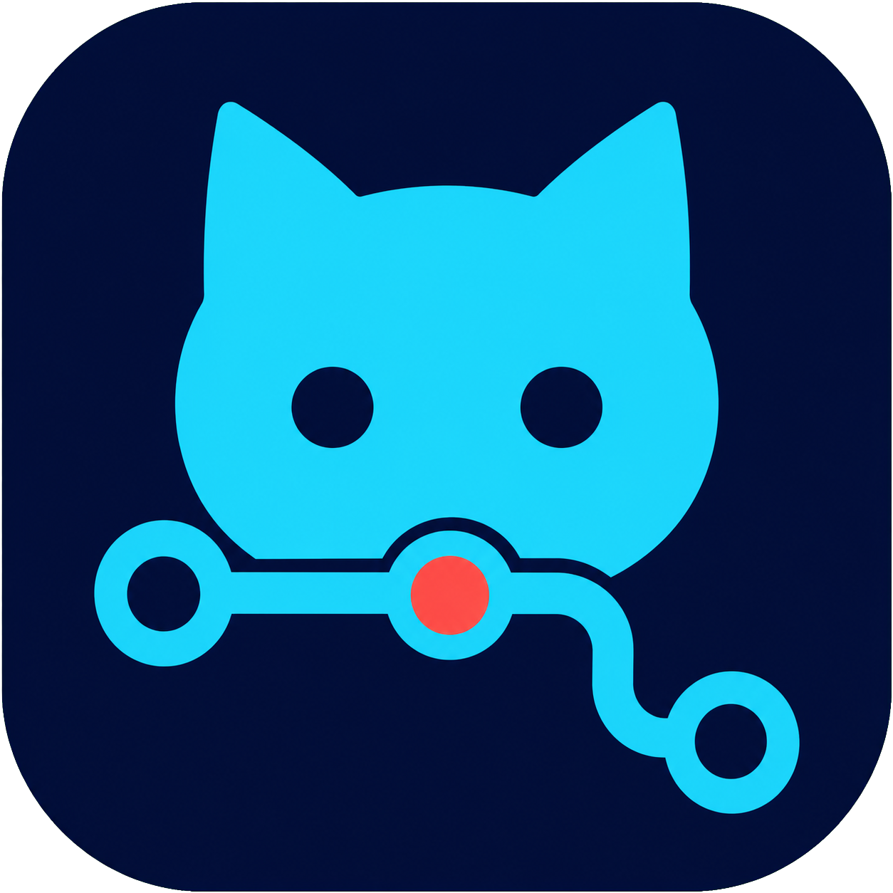

<p align="center">
  
</p>

<h1 align="center">MyGitClient</h1>

<p align="center">
  A focused desktop Git client with visual diffs, precise staging, history, branches,
  tags, and safe synchronization.
</p>

<p align="center">
  <a href="https://github.com/john27328/MyGitClient/actions/workflows/ci.yml"></a>
  <a href="https://github.com/john27328/MyGitClient/actions/workflows/windows-portable.yml"></a>
  <a href="https://www.python.org/"></a>
  <a href="https://doc.qt.io/qtforpython-6/"></a>
  <a href="LICENSE"></a>
</p>

MyGitClient is a cross-platform Qt Widgets application that delegates every operation
to the system `git` executable. It is designed to keep common Git work visible and
reversible without hiding what happens underneath.

## Highlights

- Unified and side-by-side diffs with syntax, intraline, and whitespace highlighting.
- Stage or unstage whole files, hunks, or individual changed lines.
- Commit form with generated summaries, descriptions, and amend workspace.
- Paginated history with commit graph, filtering, changed files, and commit diffs.
- Branch checkout, creation, rename, safe deletion, and optional automatic stash.
- Lightweight and annotated tags with create, delete, and push actions.
- Fetch, merge/rebase pull, push, upstream setup, and safe `force-with-lease`.
- Visible operation queue with progress, cancellation, duration, and sanitized output.
- System, light, and dark themes with persistent workspace preferences.

## Install on Windows

Download the portable ZIP and matching checksum from the
[latest release](https://github.com/john27328/MyGitClient/releases/latest), extract it,
and start `MyGitClient.exe` or `Launch MyGitClient.cmd`.

Portable builds can install later releases from `Help → Check for Updates…`. The app
downloads the Windows ZIP, verifies its published SHA-256 checksum, replaces the portable
folder through a separate updater process, and restarts itself. Source/venv installations
continue to open the release download page instead.

The archive includes the Python runtime and application dependencies. A system Git
installation must still be available in `PATH`.

## Run from source

Requirements: Python 3.12 or newer and Git.

```powershell
git clone https://github.com/john27328/MyGitClient.git
cd MyGitClient
python -m venv .venv
.venv\Scripts\Activate.ps1
python -m pip install -e .
mygitclient
```

On macOS or Linux, activate the environment with `source .venv/bin/activate`.

## Development

Active development happens on `develop`; `master` contains release-ready code. See
[PLAN.md](PLAN.md) for the roadmap and [AGENTS.md](AGENTS.md) for architecture and
contribution conventions.

```powershell
python -m pip install -e ".[dev]"
ruff check .
pyright --pythonpath python
pytest
```

## Build the portable Windows archive

```powershell
.\scripts\build-windows.ps1
```

The script bundles the application with PyInstaller, creates
`artifacts/MyGitClient-<version>-windows-<architecture>.zip`, writes a SHA-256 checksum,
extracts the result into a clean directory, and smoke-tests that extracted copy.

Use `-Python C:\Python312\python.exe` to select an interpreter or `-SkipInstall` when
build dependencies are already installed.

## Release process

1. Merge tested changes from `develop` into `master`.
2. Set the release version in `pyproject.toml`.
3. Create the matching tag on `master`, such as `v0.1.0` for version `0.1.0`.
4. Push the tag.

The `Windows portable` workflow validates the tag and its `master` ancestry, builds and
smoke-tests the archive, creates a GitHub Release with generated notes, and attaches
the ZIP and checksum. A manual workflow run uploads an Actions artifact without
creating a public Release.

## Status

MyGitClient is under active development. Back up important work and review destructive
operation confirmations carefully while testing prerelease builds.

## License

MyGitClient is free software licensed under the
[GNU General Public License v3.0 or later](LICENSE).
